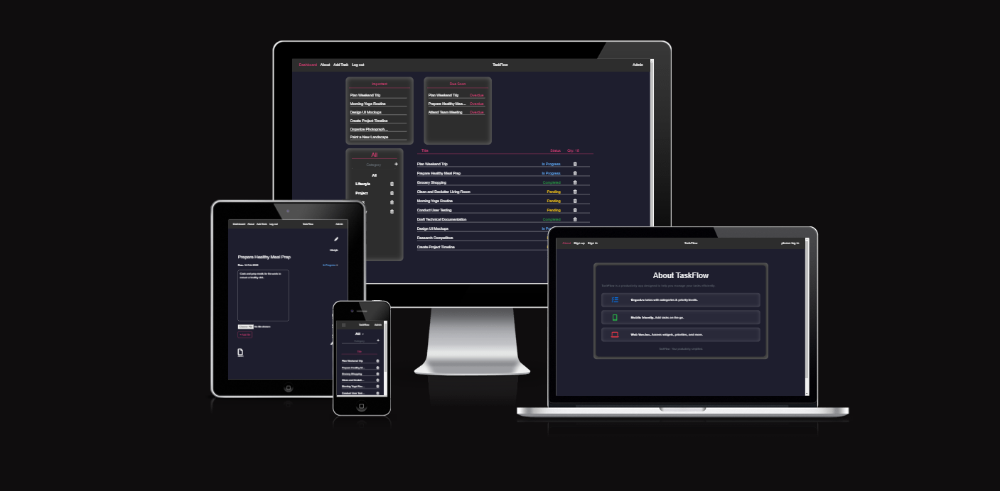
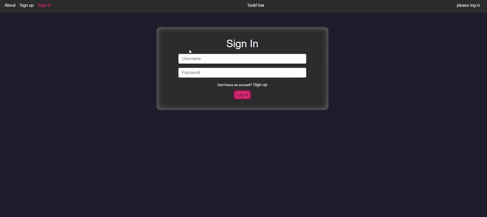
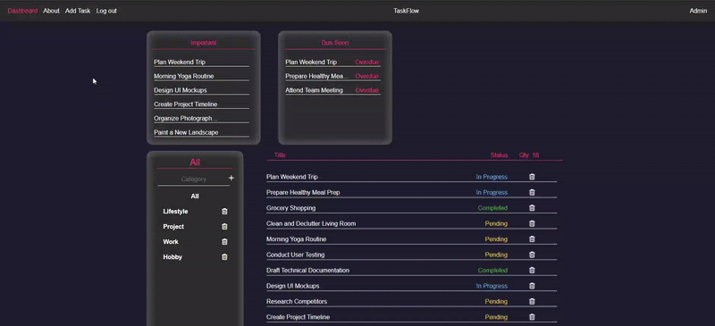
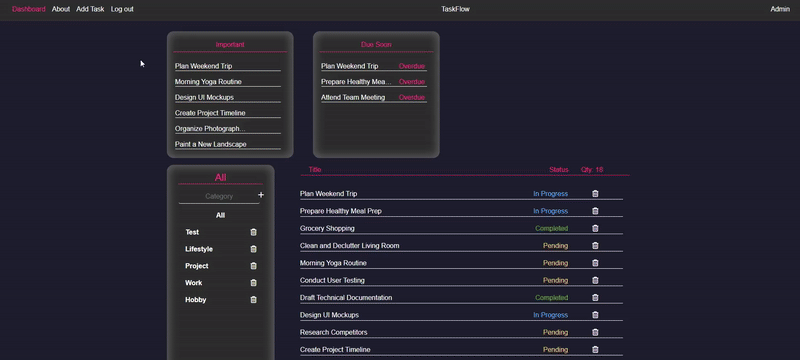
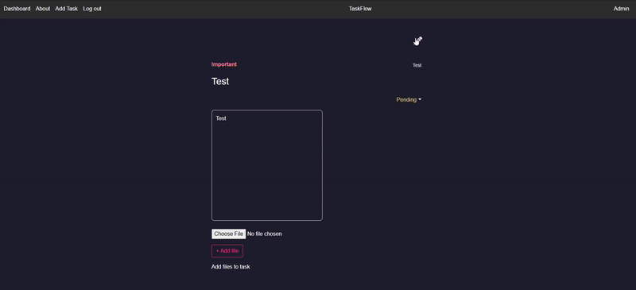
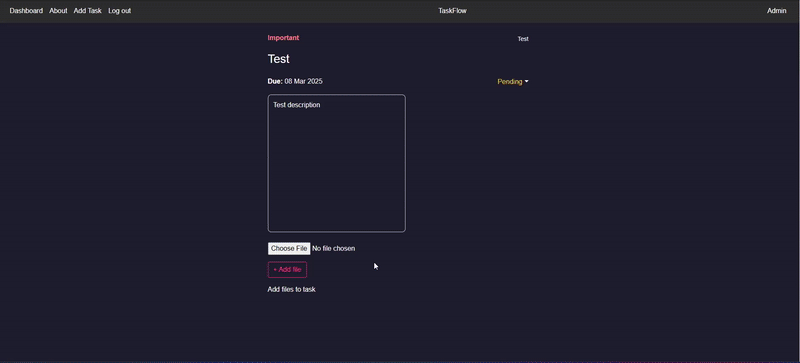

# TaskFlow

Deployed Website Links
-------------------
- View live site here - [TaskFlow](https://taskflow-react-app-6836213131c6.herokuapp.com/)

- View live API here -[Taskflow DRF API](https://task-flow-drf-api-6a658d5dbfee.herokuapp.com/)
- View API README.md here -[TaskFLow DRF API README.md](https://github.com/BrandonN3lson/taskflow-drf)

## Contents
- [About](#about)
- [Features](#features)
- [Usage](#usage)
- [Installation](#installation)
- [Technologies Used](#technologies-used)
- [Frontend Design](#frontend-design)
- [Deployment](#deployment)
- [Testing and Validation](#testing-and-validation)
- [Manual Testing Table](#manual-testing-table)
- [References](#references)
---

## About

TaskFlow is a productivity application designed to help users manage their tasks effectively. It provides an intuitive interface for, organizing tasks by category, and maintaining progress over time.

## Features

- Task management with priority and status settings (MoSCoW prioritization)
- Displays tasks due within the Current week.
- Organize tasks by category.
- File attachments for tasks (PDFs, images, etc.)
- User authentication and session management.
- Notifications using [react-toastify](https://fkhadra.github.io/react-toastify/migration-v8).
- Responsive design for a seamless experience across devices.

## Usage
1. Register with a user and password
2. Log in to your account 

3. Create a category/s in the main dashboard

4. Create a Task by clicking add Task Link on the Navigation bar and fill in the form and submit
5. To view task details, click on the task

6. Edit the task details by clicking on the edit button at the top right of the task detail page.

7. upload files to an appointed task in the task detail page, you can also delete these tasks by clicking on the edit button beside the task files

## Installation
   #### How to Fork:

   1. Log in (or sign up) to Github.
   2. Go to the repository for this project, brandonn3lson/taskflow.
   3. Click the Fork button in the top right corner.

   #### How to Clone:
   1. Find the repository for this project, taskflow
   2. **Get the Clone URL** Click on the green "Code" button and copy the URL that appears.
   3. Open Terminal or Command Prompt: Open the Terminal (Mac/Linux) or Command Prompt (Windows).
   4. Navigate to the Directory: Use the cd command to go to the folder where you want to put the cloned repository.
   5. Clone the Repository: Type git clone, paste the URL you copied, and press Enter.
   6. Wait for it to Finish: It might take a moment. Once it's done, you'll see a message.
   7. Done!: You now have a copy of the repository on your computer.

## Technologies Used

- **Frontend:** React
- **Backend:** Django Rest Framework (DRF)
- **Database:** PostgreSQL
- **Authentication:** JWT (JSON Web Tokens)
- **Styling:** react-Bootstrap 4, custom CSS
- **Notifications:** [react-toastify](https://fkhadra.github.io/react-toastify/migration-v8)
- **Cloud Storage:** Cloudinary (for images and file uploads)

## Frontend Design
- [Balsamic](https://balsamiq.com/product/)
  - [Dashboard page design](./src/assets/images/TaskFlow-indexPage-WireFrame.png)
  - [Task Detail Page design](./src/assets/images/task-detail-page-TaskFlow.png)
  - [User Authentication pages design](./src/assets/images/user-auth-pages-taskflow.png)

## Deployment

This website has been deloyed using Heruko.
The link to the website is at the start of the Readme.

## Testing and Validation
   ### Validators Used
   - W3C Validator
   - jigsaw css validator
   - Lighthouse
   - eslint

   ### W3C Validator
   - [Sign up page](./src/assets/images/w3c-validator-sign-up.png)
   - [Sign In page](./src/assets/images/w3c-html-validator-sign-in.png)
   - [Dashboard](./src/assets/images/w3c-validator-dashboard.png)
   - [About page](./src/assets/images/w3c-validator-about.png)
   - [Add Task page](./src/assets/images/w3c-validator-add-task-form.png)
   - [Task Detail page](./src/assets/images/w3c-validator-task-detail.png)
   - [Edit Task page](./src/assets/images/w3c-validator-edit-task-form.png)

   ### Jigsaw Css Validator
   All custom css passed the validator - [View here](./src/assets/images/css-validator.png)

   ### Lighthouse
   - #### Sign Up page
      - [Mobile](./src/assets/images/lighthouse-signup-mobile.png)
      - [Desktop](./src/assets/images/lighthouse-signup-desktop.png)
   - #### Sign In page
      - [Mobile](./src/assets/images/lighthouse-signin-mobile.png)
      - [Desktop](./src/assets/images/lighthouse-signin-desktop.png)
   - #### Dashboard page
      - [Mobile](./src/assets/images/lighthouse-dashboard-mobile.png)
      - [Desktop](./src/assets/images/lighthouse-dashboard-desktop.png)
   - #### About page
      - [Mobile](./src/assets/images/lighthouse-about-mobile.png)
      - [Desktop](./src/assets/images/lighthouse-about-desktop.png)
   - #### Add Task page
      - [Mobile](./src/assets/images/lighthouse-addtask-mobile.png)
      - [Desktop](./src/assets/images/lighthouse-addtask-desktop.png)
   - #### Task Detail page
      - [Mobile](./src/assets/images/lighthouse-taskdetail-mobile.png)
      - [Desktop](./src/assets/images/lighthouse-taskdetail-desktop.png)
   - #### Edit Task page
      - [Mobile](./src/assets/images/lighthouse-edittask-mobile.png)
      - [Desktop](./src/assets/images/lighthouse-edittask-desktop.png)

   ### ESLINT
   Installed ESLINT to validate react jsx code, no errors found.

### Manual Testing Table

| Feature               | Test Case Description                      | Expected Result                      | Status |
| --------------------- | ------------------------------------------ | ------------------------------------ | ------ |
| User Registration     | Register a new user with valid credentials | Account successfully created         | ✅      |
| Invalid User Registration | Register a new user with empty username and or password | Error message displayed | ✅      |
| User Login            | Login with correct credentials             | User successfully logged in          | ✅      |
| Invalid Login         | Attempt login with incorrect credentials   | Error message displayed              | ✅      |
| Task Creation         | Add a new task with title and description  | Task appears in task list            | ✅      |
| Invalid Task Creation | Add task with empty title and or category  | Error message displayed              | ✅      |
| Task Editing          | Modify an existing task                    | Task updates correctly               | ✅      |
| Task Deletion         | Delete a task from the list                | Task removed from UI and database    | ✅      |
| File Attachment       | Upload an image or PDF to a task           | File successfully attached           | ✅      |
| Category Creation     | Add a new category                         | Category appears in category list    | ✅      |
| Invalid Category Creation | attempt to add an empty category title | Error message displayed              | ✅      |
| Category Filtering    | View tasks based on selected category      | Only tasks from that category shown  | ✅      |
| Mobile Responsiveness | Open the app on a mobile device            | UI adapts correctly                  | ✅      |
| Logout                | User logs out                              | Session ends, redirect to login page | ✅      |

## References
- [Code Institute](https://codeinstitute.net/)
- [React Documentation](https://reactjs.org/docs/getting-started.html)
- [Django Rest Framework](https://www.django-rest-framework.org/)
- [PostgreSQL Documentation](https://www.postgresql.org/docs/)
- [Cloudinary API](https://cloudinary.com/documentation)
- [React-toastify](https://fkhadra.github.io/react-toastify/migration-v8)
- ***Hooks***
   - toggleOutside - Code institute moments react project
	- useRedirect - Code Institute Moments react project
- ***Context***
	- CurrentUserContext - Code Institute Moments react project
- ***helper functions(Utils.jsx)***
	- [capitilizeFirstLetter](https://codedamn.com/news/javascript/how-to-capitalize-first-letter-in-javascript)
	
	- fetchMoreData - Code Institute moments react project
    - setTokenStamp - Code Institute moments react project
    - shouldRefreshToken - Code Institute moments react project
    - removeTokenTimestamp - Code Institute moments react project